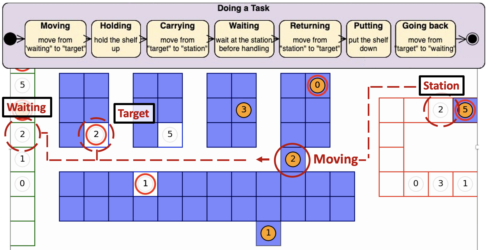

# Multi-Agent-Path-Finding

## Introduction

This is a visualizer for simulating the window-version MAPF algorithms based on the idea from following papers.
- [AAAI 2012] ([paper](https://www.aaai.org/ocs/index.php/AAAI/AAAI12/paper/viewFile/5062/5239)) Conflict-Based Search For Optimal Multi-Agent Path Finding (CBS)
- [AAAI 2021] ([paper](https://www.aaai.org/ocs/index.php/AAAI/AAAI12/paper/viewFile/5062/5239)) Lifelong Multi-Agent Path Finding in Large-Scale Warehouses.

## Demo


## Task Flow



## How to use
 
The code requires the library Matplotlib (https://matplotlib.org/).
```shell script
sudo apt install matplotlib
```

You can run the code to create a GIF:
```shell script
python3 visualize.py --video "mapf.gif" --pbs True --window_size 20 --time_step_per_planning 10 --total_run_time 100 --order_num 10 --speed 2
```

For information about parameters, you can use the command below:
```shell script
python3 visualize.py --help
```
Check codes and papers for more detail.